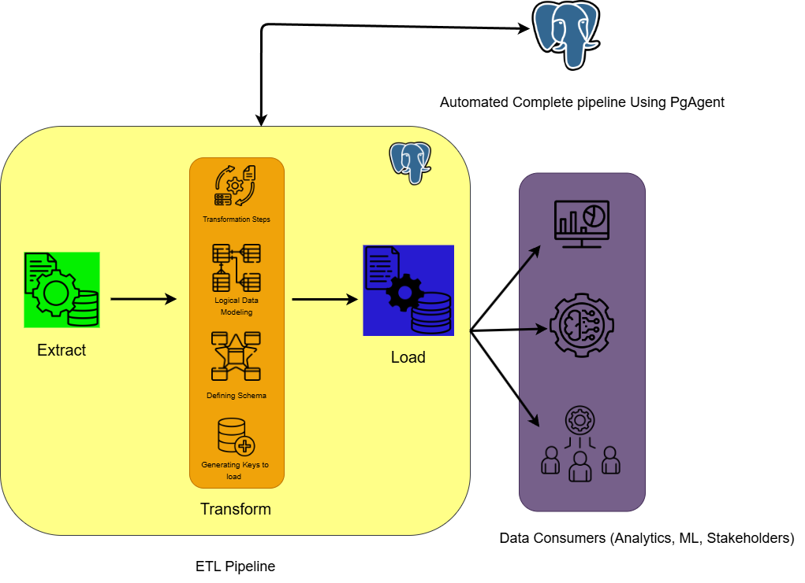
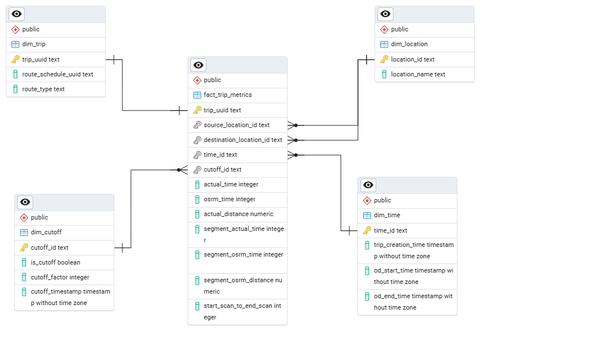

# Delhivery Logistics ETL Pipeline & Warehousing



A **PostgreSQL-based ETL pipeline** designed to analyze trip-level logistics data from Delhivery. This project transforms raw logistics trip records into a **star schema** optimized for analysis and reporting. It also includes **automated data loading** using `pgAgent`.

---

## ✅ Real-World Problem It Solves

Delhivery, like any logistics company, generates massive trip-level data from deliveries. But raw CSVs and operational databases are not optimized for analytics. This project solves that by:

- Structuring messy, real-world trip data into a clean **star schema**
- Providing key insights into trip delays, distance discrepancies, and cutoff impact
- Enabling **scheduled ETL** jobs for daily reporting and dashboards
- Making trip analytics faster, cleaner, and more maintainable

---
## 📊 Star Schema Design

> Efficiently structured for BI tools and SQL queries.



### 📌 Fact Table
- `fact_trip_metrics`: Central table with computed trip metrics like time differences, distance comparisons, and cutoff status.

### 📌 Dimension Tables
- `dim_location`: Source and destination centers with state info  
- `dim_trip`: Static trip details like route type  
- `dim_time`: Temporal dimension with trip start and end timestamps  
- `dim_cutoff`: Captures cutoff logic for delay analysis  

---

## 🔄 ETL Process Flow

> Converts raw, unstructured data into clean star-schema-ready tables.


### Key Steps:

1. **Staging Table Creation**
   ```sql
   CREATE TEMP TABLE staging_cleaned AS ...
   ```

2. **Cleaning & Transformation**
   - Standardize date formats
   - Extract state info from location strings
   - Enforce null checks and filters

3. **Dimension Table Insertion**
   - Populate dimension tables using INSERT ... SELECT with deduplication and parsing

4. **Fact Table Population**
   - Join dimensions and derive metrics like actual_time, osrm_time, distance_diff, etc.

## ⚙️ ETL Automation via pgAgent

The pipeline is scheduled to run daily using PostgreSQL's pgAgent extension.

### 💡 Stored Procedure

```sql
CREATE OR REPLACE PROCEDURE run_etl_pipeline()
LANGUAGE plpgsql
AS $$
BEGIN
    -- ETL logic goes here
    RAISE NOTICE 'ETL Completed';
END;
$$;
```

### 🕐 Scheduling

- **Tool**: pgAgent via pgAdmin
- **Frequency**: Daily at 2 AM
- **Error Handling**: Includes basic notifications and transactions
- **Purpose**: Keeps star schema up-to-date for downstream analysis tools or dashboards

